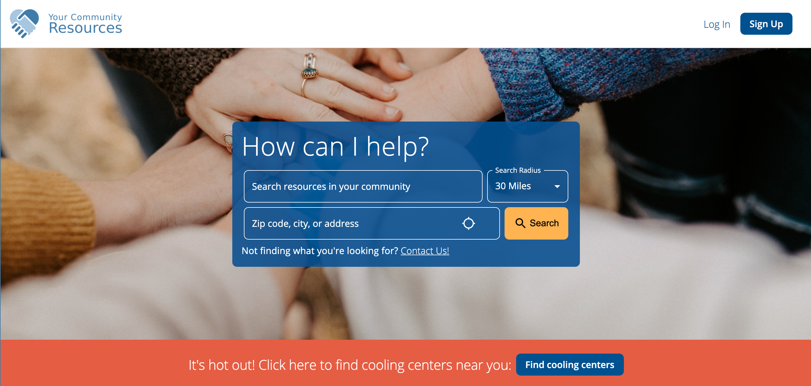

# Open Resource Search

The goal of this project is to provide all 211s with an equal opportunity at a rich user experience, modern speed and efficiency for data searchability, and a low barrier to entry.

## Dependencies

- [Open Resource API](https://github.com/211-Connect/open-resource-api)
- Amazon Web Services
  - Cognito
  - Simple Email Service
- A hosting platform
  - We recommend Vercel
  - Other options include Digital Ocean App Platform, Netlify, Render, etc.
- Google Maps
- Google Places

## Run Locally

Clone the project

```bash
  git clone https://github.com/211-Connect/open-resource-search
```

Go to the project directory

```bash
  cd open-resource-search
```

Install dependencies

```bash
  npm install
```

Start the server

```bash
  npm run dev
```

## Deployment

For automated CI/CD we recommend Vercel. Getting set up is as simple as clicking the Deploy button below.

[](https://vercel.com/new/clone?repository-url=https%3A%2F%2Fgithub.com%2F211-Connect%2Fopen-resource-search)

If you'd like to host this on your own, or on an alternative platform, you'll need to do the following:

install dependencies

```bash
npm install
```

build the project

```bash
npm run build
```

and then start the server

```bash
npm start
```

## License

Copyright (C) 2021 Connect 211

This program is free software: you can redistribute it and/or modify
it under the terms of the GNU General Public License as published by
the Free Software Foundation, either version 3 of the License, or
(at your option) any later version.

This program is distributed in the hope that it will be useful,
but WITHOUT ANY WARRANTY; without even the implied warranty of
MERCHANTABILITY or FITNESS FOR A PARTICULAR PURPOSE. See the
GNU General Public License for more details.

You should have received a copy of the GNU General Public License
along with this program. If not, see <https://www.gnu.org/licenses/>
